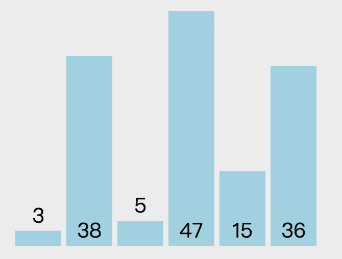

# 算法
## 排序算法
### 冒泡排序
> 冒泡排序是排序算法中最简单的，然后从运行角度来看，它却是最差的一个。    
冒泡排序的原理很简单，就是比较任何两个相邻的项，如果第一个比第二个大，则交换他们。元素项向上移动至正确的顺序，就好像气泡上升到表面一样，冒泡排序因此得名。

**步骤**
- 比较相邻的元素，如果第一个如第二个大，就交换他们两个。
- 对每一组相邻元素作同样的工作，从开始第一对到结尾的最后一对，这步做完，最后的元素会是最大的数。
- 针对所有的元素重复以上步骤，直到没有任何一对数字需要比较。

### 选择排序
> 选择排序是一种原址比较排序算法，选择排序大致的思路就是找到数据结构中最小的值并将其放在第一次，然后找到第二小的值，将其放在第二位...以此类推

**步骤**
- 找到最小的值，和第一个元素交换。
- 知道第二小的值，和第二个元素交换
- 以此类推..

### 插入排序

### 归并排序

### 快速排序

## 搜索算法

### 顺序搜索

### 二分搜索

## 补充知识
### 递归
> 能够调用自身的方法或函数就是递归函数,每个递归函数都必须有一个边界条件，即一个不再递归的条件（停止点），以防止无限递归，无限递归会导致栈溢出（stack overflow error）。

### 时间复杂度

### 空间复杂度

## 参考
- [用动画的形式呈现解LeetCode题目的思路](https://github.com/AnsonZnl/LeetCodeAnimation)
- [十大经典排序算法动画与解析，看我就够了！（配代码完全版）](https://mp.weixin.qq.com/s/vn3KiV-ez79FmbZ36SX9lg)
- [用动画学算法](https://visualgo.net/zh/sorting)